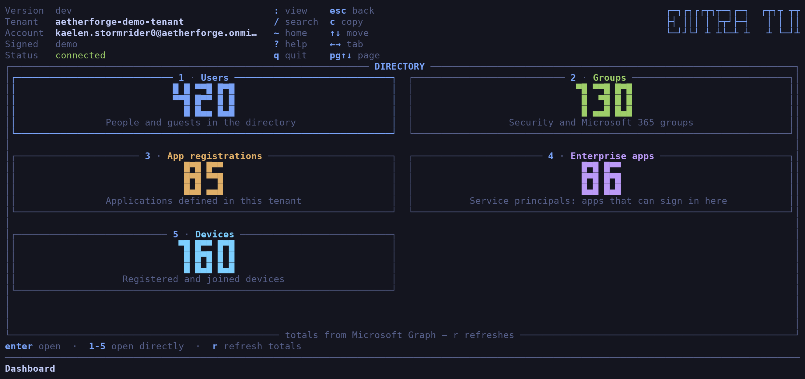
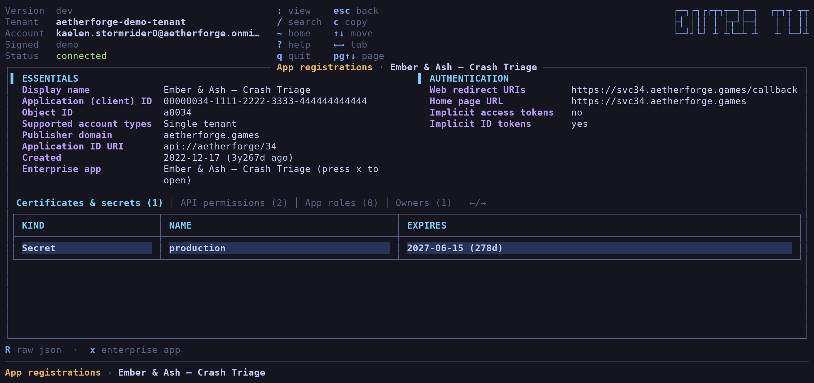
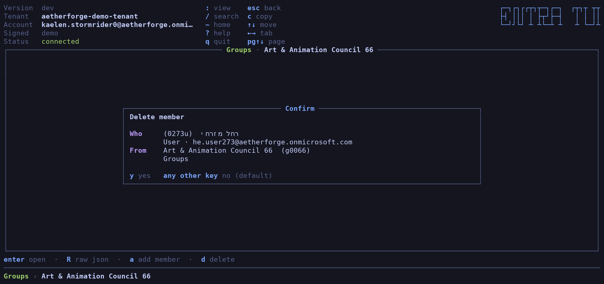

+++
date = '2026-09-13'
draft = false
title = 'entra-tui: Microsoft Entra ID, Now Without the Mouse'
description = 'A terminal UI for Microsoft Entra ID in the spirit of k9s — browse users, groups, app registrations, enterprise apps and devices from the keyboard, signed in with your existing az login session.'
summary = 'I keep building terminal UIs, because the mouse is a peripheral I resent. entra-tui is the newest one: a k9s-flavoured browser for Microsoft Entra ID that borrows your az login token, never holds one of its own, and gets you to an object in three keystrokes instead of nine clicks. Written entirely in Go — by Claude, with me driving.'
tags = ['entra', 'azure', 'golang', 'tui', 'bubbletea', 'microsoft-graph', 'ai', 'claude']
categories = ['Projects']
toc = true
+++

I like terminal UIs. I like *using* them, and it turns out I like building them
even more. This is not my first one — [TFTUI](https://github.com/idoavrah/terraform-tui)
has been keeping people out of `terraform state list | grep` for three years —
and going by the evidence, it will not be my last.

The reasoning is not complicated. Who wants to reach for a mouse when that can
be avoided? The mouse is a device that asks you to take your hands off the
keyboard, move a small plastic animal across a desk, aim at a rectangle drawn by
someone who has never met you, and click it. Then do it eight more times, because
the thing you actually wanted was four blades deep in a navigation tree.

Which brings us, inevitably, to the Azure Portal.

Meet **[entra-tui](https://github.com/idoavrah/entra-tui)**: a terminal browser
for Microsoft Entra ID, in the spirit of [k9s](https://k9scli.io). Same
vocabulary — `:` changes view, `/` searches, `Esc` backs out, `?` explains
itself. If your fingers already know k9s, they already know this.



## What it does

Five things to look at — users, groups, app registrations, enterprise apps and
devices. Each one is a digit on the dashboard, or a word after a colon if you
prefer typing to counting.

Lists are tinted by state rather than by a column you have to go and read:
disabled accounts dimmed, lapsed credentials amber.


## Getting around

Search hits the directory itself, not the rows that happen to be on screen — and
a search that found something gets a number, so you can fire it again later with
one keystroke instead of retyping it.

Open any object and you get its own fields on top, with everything it is
*connected* to as tabs underneath: members, owners, groups, certificates, API
permissions, app roles.



From there you can keep going. Open a member, then that member's group, then an
owner of that — a trail along the bottom shows how deep you are, and you back
out one layer at a time.


A few things I wanted and now have:

- Jumping straight between an app registration and its enterprise app, which
  are two halves of the same thing in Entra and roughly four thousand miles
  apart in the portal.
- API permissions shown as **names**, not as a column of GUIDs.
- The raw JSON, one key away, for when the pretty view has opinions.
- Copying an object id straight to the clipboard — including over SSH, to the
  machine you are actually sitting at.
- Hebrew and Arabic names that read the right way round, because most terminals
  will not do that for you.


## What it will change

Almost nothing, on purpose. entra-tui creates no objects, deletes no objects and
renames nothing. What it will edit is who belongs to what: group members and
owners, application owners, device owners, and who is assigned to an enterprise
app.

Every change is confirmed first, naming both sides by display name *and* by id,
and only `y` goes through.



## The security model

This is the part I would want to read about someone else's tool before pointing
it at my tenant:

- **It has no credentials of its own.** No client id, no scopes, no browser
  flow, nothing cached on disk. It borrows the token from your existing
  `az login` session, so it can only ever do what you can already do. It cannot
  widen its own permissions, because they were never its permissions.
- **It signs in before drawing anything.** A dashboard that renders, says
  "connected", and then quietly admits it never signed in is worse than no
  dashboard.
- **Names from the directory are treated as hostile.** A display name is
  attacker-controlled in any real tenant, and a terminal is an interpreter.
  Everything is scrubbed before it is drawn, and there is a test that renders
  every screen from a name booby-trapped with escape sequences.
- **Failed writes are reported, never retried.** A change that may already have
  landed does not get a second attempt.

## Try it with no tenant at all

```sh
entra-tui -demo
```

No tenant, no sign-in, no network — it invents a fictional game studio on the
spot and browses that instead. 420 people, 130 groups, 85 app registrations, 160
devices, a believable number of ownerless objects, and Hebrew names so the
right-to-left handling gets exercised by default.

Every screenshot in this post is that fake studio.

## The Go part, and the Claude part

Here is the bit I should be straight about: **I did not write this code. Claude
did.** All of it, in Go — [Bubble Tea](https://github.com/charmbracelet/bubbletea)
and [Lipgloss](https://github.com/charmbracelet/lipgloss) for the interface, and
the standard library for everything else. Three direct dependencies, total.

TFTUI was Python. This one is Go, which means it ships as one static binary with
nothing to install alongside it.

Where it landed:

| | |
|---|---|
| Application code | ~10,300 lines |
| Test code | ~7,100 lines |
| Tests | 327 |
| Direct dependencies | 3 |
| CI checks | `go test`, `go vet`, `gofmt`, `govulncheck`, 5-platform cross-compile |

Two testing habits are doing most of the work. **Golden screens**: every screen
is rendered from the demo directory and committed as text, so a layout change
shows up as a readable diff rather than as nothing at all, and CI fails if
they are stale. And **driving the real binary** through a PTY with a terminal
emulator attached — fork, set the window size, answer the terminal queries
Bubble Tea blocks on, send keys, read the grid back cell by cell. That rig has
caught bugs in a single round that the unit tests were never going to see. It
also draws the PNGs above, straight out of the terminal buffer.

My job was the other half: running it, finding the places where it was wrong,
and saying so. That loop is the whole trick. It is also why the architecture
notes in the repo read like a list of confessions — each invariant is something
that has already broken once, written down so it does not break twice.

## Install it

```sh
brew install idoavrah/homebrew/entra-tui
```

Or `go install github.com/idoavrah/entra-tui/cmd/entra-tui@latest`, or grab a
binary for macOS, Linux or Windows from
[Releases](https://github.com/idoavrah/entra-tui/releases).

Then:

```sh
az login
entra-tui
```

## Now your turn

entra-tui is a few days old, MIT-licensed, and deliberately unfinished. Directory
roles, administrative units, conditional access policies, sign-in logs — none of
it is there yet.

That is not an oversight, it is the whole approach. I did not want to build
bloatware: a tool with forty views, thirty-eight of which nobody opens twice,
each one more surface to maintain and more clutter between you and the thing you
came for. I would rather ship the small set I know gets used and then add what
people actually reach for — so tell me what that is, and I will build it.

So please: **break it and tell me about it**. Open an
[issue](https://github.com/idoavrah/entra-tui/issues) when a view is wrong, when
something your tenant has is missing, or when a name renders in a way that makes
you sad. Open a [PR](https://github.com/idoavrah/entra-tui/pulls) if you would
rather just fix it. And if you only have opinions about the keybindings, I want
those too — I have strong opinions about keybindings, which is exactly why other
people's are useful.

A star is also fine. I am not proud.

[GitHub](https://github.com/idoavrah/entra-tui) ·
[Screens](https://github.com/idoavrah/entra-tui/blob/main/docs/screens.md) ·
[Security model](https://github.com/idoavrah/entra-tui/blob/main/SECURITY.md)
