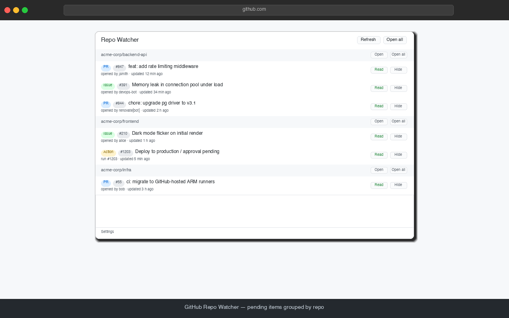

GitHub's notification inbox has a design philosophy: tell you everything, and let
you sort it out. Someone labels an issue, a bot bumps a dependency, a colleague
replies to a thread you commented on eleven months ago — it all lands in the same
pile. So most of us do one of two things. We check the pile constantly, or we stop
checking it at all.

**GitHub Repo Watcher** takes a narrower swing. It watches a handful of repos you
actually care about and answers one question from your browser toolbar: *is
anything waiting on me right now?*

Most of the time the answer is a small green dot. When it isn't, you get a number.

<!--more-->

*Everything waiting on you, grouped by repo. Three repos here; the badge on the
toolbar would read 6.*

## What it actually watches

You pick the repos. For each one you choose what counts:

- **Issues** — open issues with new activity
- **Pull requests** — same, for PRs
- **Actions** — workflow runs sitting in the "waiting for approval" state

That last one is quietly the most useful if you work somewhere with deployment
gates. A run that's paused waiting for someone to click approve is invisible in
your notification inbox, but it's exactly the kind of thing that blocks a release
while everyone assumes someone else is on it.

"New activity" means the item's *updated* timestamp has moved since you last
acknowledged it. Comments, labels, edits, review requests — anything GitHub
counts as an update.

## Getting set up

**Install it.** Grab it from the [Chrome Web Store](https://chromewebstore.google.com/detail/github-repo-watcher/hbncbaflbaemhdnpilcpcpghhenabcjl) — one click and Chrome handles the rest.

**Sign in.** Open the extension's Settings and click **Sign in with GitHub**. A
GitHub tab opens, you paste in the short code it gives you (it's already on your
clipboard), and you approve. That's the whole thing — there's no access token to
generate, copy, paste, or remember to rotate in six months.

The extension asks for **read-only** access to issues, pull requests, Actions,
and basic repo info. It cannot write anything to your repositories. Not comments,
not labels, not code.

**Give it access to the right repos.** This is the one step that trips people up,
so it's worth thirty seconds of explanation.

Signing in tells GitHub *who you are*. It doesn't automatically decide *which
repos the extension may read*. Those are two separate things, and how much you
need to care depends on what you're watching:

| What you want to watch | What you need to do |
| --- | --- |
| Public repos — anyone's | Nothing. Signing in is enough. |
| Your own private repos | Install the app on your account. Takes one click. |
| A company or org's private repos | An org **owner** has to install it. |

For that last case, use **Manage repository access** in Settings. If you're an
org member but not an owner, picking the org there sends the owners an install
request rather than failing silently. Settings also shows you where the app is
currently installed, so you can tell at a glance whether a missing repo is an
access problem or a typo.

**Add your repos.** Type them as `owner/repo`, tick Issues / PRs / Actions per
repo, and save. Use the ▲▼ arrows to reorder — that order controls how the popup
groups things, so put the repo you care most about on top.

One thing to expect: when you first add a repo, *everything* currently open shows
up as pending. That's deliberate — it's the same view you'd get filtering that
repo by `is:open`. Clear it once and you're at a real baseline from then on.

## Living with it

Click the toolbar icon and you get the view from the screenshot above — pending
items, grouped by repo. From there:

- **Click an item** — opens it in a new tab and marks it read.
- **Middle-click** — opens it in a background tab and *leaves it unread*. Good for
  triage: fan out five tabs, keep the list intact, deal with them in order.
- **✓** — marks it read without opening it. For the "oh, that's fine" ones.
- **🙈** — hides it for good. Some threads just aren't yours; this stops them
  resurfacing every time somebody adds a comment. Hidden items are listed in
  Settings if you change your mind.
- **Open all** — opens everything pending for that repo and clears it.

Desktop notifications show up when something new appears, with a **Mark as read**
button right on the notification, so the common case never needs a click into the
browser at all.

## The bit I like most

If you were the last person to comment on an issue or PR, the extension quietly
marks it as read for you.

The logic being: you already replied. The ball is in their court. You don't need
a badge reminding you about a conversation you're waiting on someone else to
continue. It's a small thing that removes a surprising amount of noise once you
have a few chatty repos in the list.

(This applies to issues and PRs. Waiting Actions runs always show up, because
those genuinely are blocked on somebody clicking a button.)

## Settings worth knowing about

**Poll interval** — every 5 minutes by default. Turn it down if you want to be
closer to real time, up if you'd rather it stay out of the way. Minimum is one
minute.

**Only show issues/PRs assigned to me** — the single biggest noise reduction
available if you're in busy repos. Off by default, because plenty of people watch
repos they aren't assigned in.

**Popup font size** — 10 to 22 pixels, because default UI text sizes are a matter
of taste and eyesight, not correctness.

## Where your data lives

Nowhere but your browser.

There's no server behind this thing. Your access token, your repo list, and the
cached list of pending items all sit in Chrome's local extension storage on your
own machine. The extension talks to GitHub's API directly, using your own
credentials, and to nothing else. No analytics, no telemetry, no phoning home,
nobody's dashboard counting how many issues you have open.

Signing out clears the token locally, and it expires on its own within eight
hours regardless. If you want to cut access off entirely and immediately, revoke
the app under GitHub → Settings → Applications.

## When a repo doesn't show up

Nine times out of ten it's one of three things:

1. **A typo in `owner/repo`.** Easy to rule out.
2. **The app isn't installed where it needs to be.** For private repos this is by
   far the most common cause — and GitHub deliberately returns "not found" rather
   than "not allowed" for repos an app can't see, so the two look identical from
   outside. Settings spells out both possibilities when a repo fails to load.
3. **It's genuinely quiet.** No new activity means nothing pending. Working as
   intended.

If a repo isn't loading, hit **Re-check now** in Settings after fixing access —
no need to reload anything.

## Is it for you?

If you live in your GitHub notification inbox and like it there, probably not.

If you've got three to ten repos you're responsible for, you've muted your
notification email, and you have a low-grade background worry that something is
sitting there waiting for you right now — that's exactly the itch this scratches.

A green dot means you're clear. That turns out to be worth a lot.
