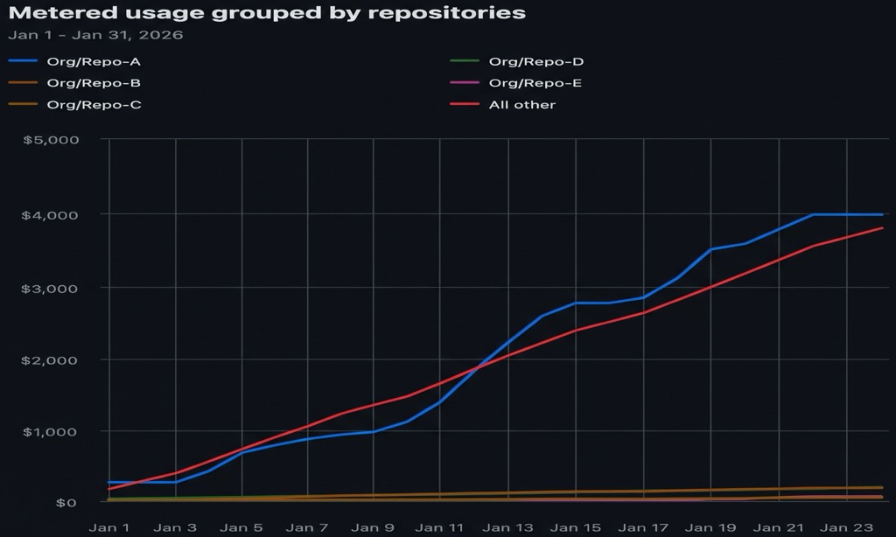

+++
date = '2026-01-24T16:19:19+02:00'
draft = false
title = 'How I Slashed an Entire Org’s GitHub Actions Spend by 50% with One Repo'
+++

In an organization with hundreds of repositories, you wouldn’t expect a single workflow in a single repo to be the primary driver of cost. Yet, in our case, the **Pareto principle** hit hard: one high-traffic repository was responsible for a staggering **50% of our entire GitHub Actions spend**.

This is a story about **leverage**. Most engineering teams try to shave 5% off everything; we saved 50% of the entire org's bill by identifying and fixing the right 1%.



_As shown above, the blue line (our primary repo) consistently matched the cumulative spend of every other repository in the organization combined (the red line)._

By implementing a combination of caching, concurrency management, and infrastructure optimization, we neutralized this cost center. Here is how we identified the leaks and plugged them, saving thousands of dollars every month.

---

## 1. The Strategy: Strategic Caching

The primary culprit was the **`npm install`** and **`npm build`** cycle. With hundreds of PRs and pushes every week, every job was starting from a clean slate—downloading 100s of MBs of dependencies and recompiling the entire project.

### Leveraging `actions/cache`

We stopped "starting from zero" by using a tiered caching strategy.

```yaml
- name: Cache Node Modules
  uses: actions/cache@v4
  with:
    path: ~/.npm
    key: npm-${{ hashFiles('**/package-lock.json') }}
    restore-keys: |
      npm-
```

**Why this works:**

- **Primary Key:** Uses a hash of your lockfile. If your dependencies don't change, the cache hit is 100%.
- **Restore Keys:** If you add _one_ new package, the hash changes (Primary Key miss). GitHub falls back to the most recent cache starting with `node-`. `npm` then only downloads the _difference_.
- **Retention:** GitHub keeps these for **7 days** (rolling), with a **10 GB** limit per repo before LRU (Least Recently Used) eviction kicks in.

---

## 2. Eliminating "Ghost Runs" with Concurrency

The biggest waste of money in a busy repo is paying for CI on code that is already obsolete. If a developer pushes three times in ten minutes, you shouldn't be paying for three full test suites.

### The Concurrency Guard

By adding a `concurrency` block, we ensured that whenever a new commit is pushed to a PR, the _previous_ running job is instantly killed.

```yaml
concurrency:
  group: ${{ github.workflow }}-${{ github.event.pull_request.number || github.ref }}
  cancel-in-progress: true
```

- **For PRs:** It cancels the old, useless run.
- **For Main:** It ensures deployments happen sequentially, preventing race conditions that require expensive manual re-runs.

---

## 3. Optimizing the Database: Action vs. Docker

Many of our workflows used the `services:` keyword to spin up a PostgreSQL Docker image. While convenient, pulling a 200MB image and waiting for the Docker engine to initialize added **45–60 seconds** to every single job.

### Switching to `setup-postgres`

By switching to a native Action that utilizes the pre-installed binaries on the GitHub runner, we cut the database startup time from 60 seconds to **under 10 seconds**.

| Metric                | Docker Service       | `setup-postgres` Action  |
| --------------------- | -------------------- | ------------------------ |
| **Startup Time**      | ~60s                 | ~8s                      |
| **Resource Overhead** | High (Docker Engine) | Minimal (Native Process) |
| **Billed Savings**    | Base Cost            | **Saved 50s per run**    |

---

## 4. The Final Results

The impact was immediate. By narrowing the scope of what we ran and ensuring we never ran it twice, the billing dashboard showed a massive shift:

| Metric                     | Before        | After               |
| -------------------------- | ------------- | ------------------- |
| **Avg. Workflow Duration** | 14 minutes    | 5 minutes           |
| **Redundant Runs**         | ~20% of total | 0% (Auto-cancelled) |
| **Total Org Bill**         | 100%          | **52%**             |

### Key Takeaways

1. **Find the Surgical Point:** Massive results don't require massive changes. Find the 1% of your system that drives 50% of your problems, and fix it first.
2. **Use Tiered Caching:** Don't start from zero. Use `restore-keys` so that even if your primary cache misses, you only download the delta.
3. **Stop "Ghost Runs":** Use concurrency guards to kill obsolete jobs instantly. Paying for CI on code that's already been superseded is pure waste.
4. **Prefer Native over Docker:** If a pre-installed binary exists on the runner, use it. Avoiding the Docker pull and engine initialization can save 80% of your startup time.
