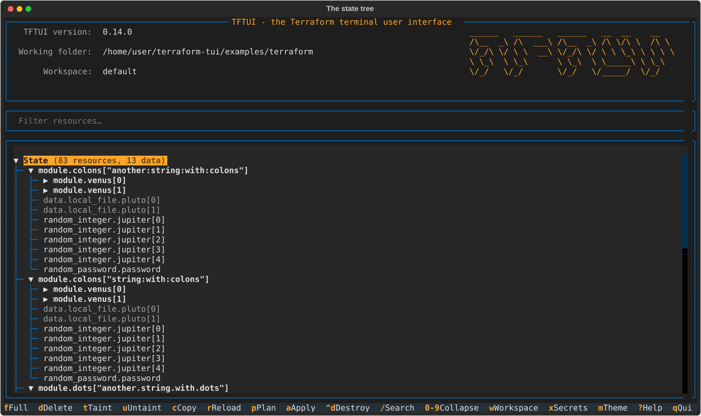
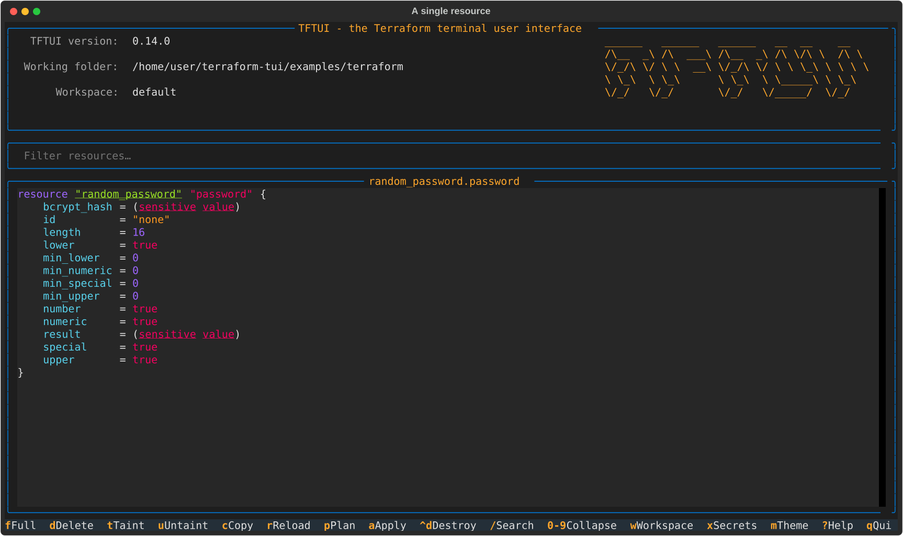
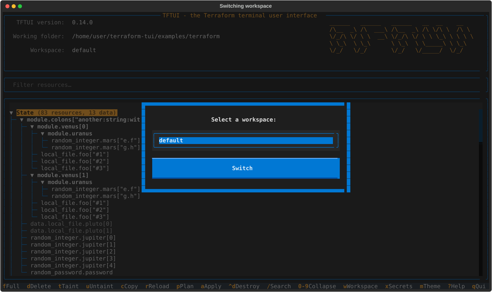
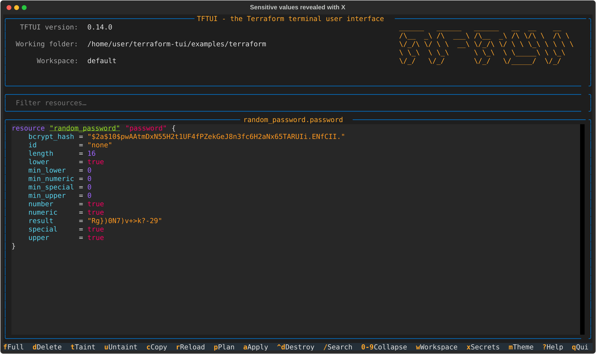
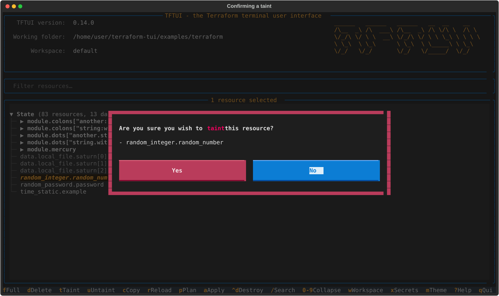
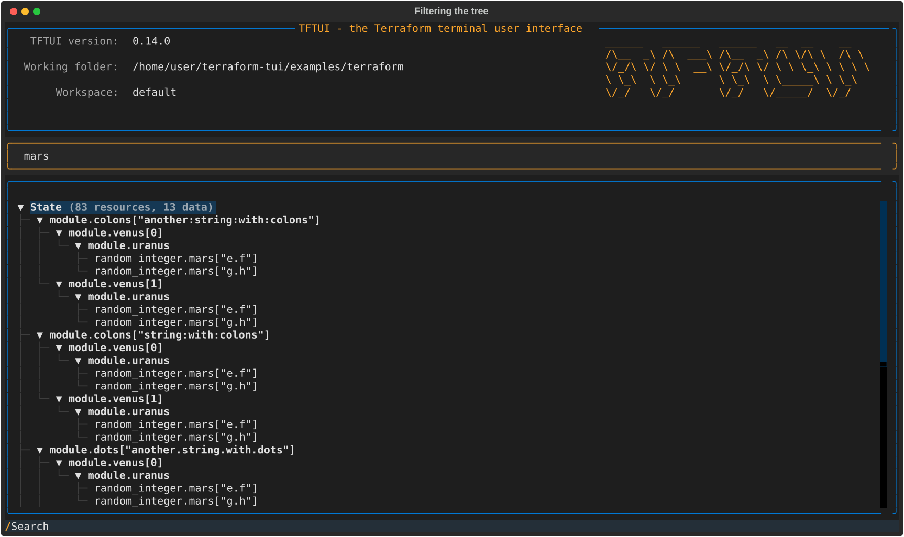
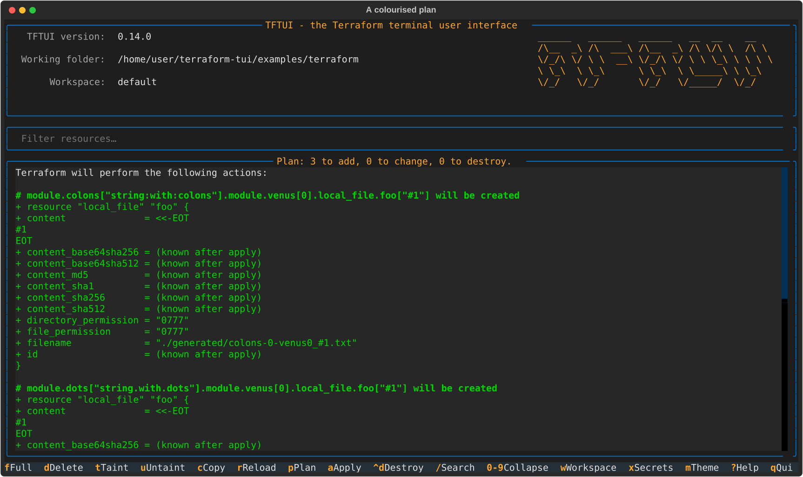
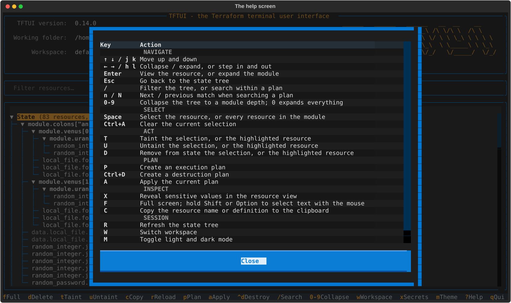

+++
date = '2026-09-07'
draft = false
title = 'TFTUI 0.14: I Handed My Own Project to an AI for a Day'
description = 'A complete rewrite of TFTUI, the terminal UI for Terraform state — new internals, 406 tests, CI on three platforms — that Claude Code delivered in a single day.'
summary = 'TFTUI is a terminal UI for Terraform state that I wrote three years ago, mostly by feel. Version 0.14 is a complete rewrite — new internals, 406 tests, CI on three platforms — that Claude Code did in a single day while I drove and reviewed. Here is what changed, what broke, and what the experience actually taught me.'
tags = ['terraform', 'opentofu', 'python', 'textual', 'tui', 'ai', 'claude']
categories = ['Projects']
toc = true
+++

I wrote [TFTUI](https://github.com/idoavrah/terraform-tui) because I was tired of
`terraform state list | grep`. Thirty-four releases later, it is a tool other
people rely on — and also a codebase I had started to wince at whenever I opened
it.

Version **0.14** is a complete rewrite. Same application, same keybindings, same
flags — entirely new internals.

I did not write it. I handed the project to [Claude
Code](https://claude.com/claude-code) with a one-paragraph brief — *"same basic
logic but better code… make it secure, fast and convenient"* — and spent the day
directing it, running the builds it produced, and telling it what was broken. It
took **one day**.



## What the old code actually looked like

I should be honest about the starting point, because it is the whole story.

TFTUI 0.13 was one `__main__.py` file of **795 lines**, written by me, by feel,
over three years. It held the Textual application, the argument parsing, the
Terraform subprocess calls, the state parser, the plan colouriser and the
clipboard handling. Alongside it sat a 2,875-line `constants.py`, which was —
almost entirely — a word list used to generate the anonymous two-word handle for
usage tracking.

There were **zero tests**. Not "a few tests". Zero. The `test/` directory
contained Terraform fixtures I ran by hand.

CI consisted of two workflows: one to close stale issues, one to publish to PyPI.
Nothing ever ran the application before it shipped.

It worked. People used it. But every change was a small act of faith.

## What 0.14 is

Claude broke the single file into layers:

```
src/tftui/
├── terraform/   executor, address, state, plan, client — never imports Textual
├── widgets/     state tree, searchable resource and plan panes, header
└── screens/     modal dialogs
```

One rule holds the whole thing together: **`terraform/` never imports Textual,
and the widgets never build argv.** Parsing and plan colouring became pure
functions over strings, which means they can be tested directly without
rendering anything.

The numbers, for the record:

| | 0.13 | 0.14 |
|---|---|---|
| Tests | 0 | **406** |
| Test code | 0 lines | 3,245 lines |
| CI test jobs | 0 | 12 |
| Platforms tested | none | Linux, macOS, Windows |
| Python versions | 3.9+ | 3.10–3.13 |
| Terraform implementations | assumed | Terraform **and** OpenTofu, both in CI |
| `mypy --strict` | no | clean |

Worth noting what that table does *not* say: the application did not get smaller.
Strip out the word list and 0.13 was about 1,400 lines of Python; 0.14 is roughly
3,400. Splitting one file into layers, adding type annotations everywhere and
handling the error paths properly costs lines. It buys the ability to change
things without holding your breath.

406 tests across three layers: unit tests over the parsers, end-to-end tests
driving the real application through Textual's `Pilot` harness, and an
integration suite running a real `terraform` binary against a bundled example
project.



## The bugs nobody knew about

This is the part I did not expect. Writing the code down properly — with types,
and then with tests — surfaced defects that had been shipping silently for
months. None of them had an open issue. I did not know they were there:

- Tainted resources rendered as ordinary ones.
- The `R` key — refresh — did nothing at all.
- Typing `j` or `k` in the search box scrolled the tree.
- The `-n` / `--no-init` flag was parsed and then ignored.
- Revealed sensitive values were matched by position rather than by name.
- Selections vanished on any refresh.
- Listing workspaces raised `UnboundLocalError` when the command failed.

Every one of them was found by Claude in the course of the rewrite, not by a user
reporting it.





## Hardening the security model

Terraform state is full of secrets, and the brief asked for *secure*. Four things
changed.

**Plan files moved out of your working directory.** TFTUI used to write
`tftui.plan` next to your `.tf` files. A plan embeds resource attribute values —
including sensitive ones — so that file was one `git add .` away from being
committed to your repository. Plans now go to a private temporary directory
created with mode `0700`, and are deleted when superseded, when applied, and on
exit.

**No shell, ever.** Terraform is invoked with an argument list, never through a
shell, and arguments are never re-split on whitespace. A resource address
containing spaces, quotes or `$` passes through verbatim instead of becoming an
injection vector.

**`TF_INPUT=0` and closed stdin**, so Terraform can never block waiting for input
behind the UI.

**A plan is discarded once applied**, so a stale plan cannot be re-applied
against state that has moved on.

## The features you asked for

Three long-open issues closed in this release.

**Space on a module selects everything under it** ([#82]). Expanding moved to
`Enter`, the arrows, and the digit keys. The selection count now appears on the
pane border — it used to be written to a field this layout never displays, so
selecting forty resources gave you no feedback at all.



**`/` searches plans and resources** ([#89]), not just the tree. In the tree it
still filters; in a plan or a resource, matches are highlighted *in place* rather
than filtered out — a diff without its surrounding context is not worth
searching. `n` and `N` step through them.






**`-f` / `--var-file` can be repeated** ([#62], [#85]), applied in order, and is
passed to `init` as well as `plan` — which is what OpenTofu 1.8+ needs to
evaluate variables used in a `backend` block.

Plus: every flag now has a `TFTUI_*` environment variable, `-C` / `--chdir` runs
against another directory, `Ctrl+A` clears a selection, and destructive
confirmations default to **No**.



## The honest part: it broke things too

A rewrite in a day is not a rewrite without regressions, and I want to be
straight about this rather than sell a fairy tale. I ran the new build and
immediately found four things wrong:

- The left and right arrow keys did nothing in the tree.
- The resource pane painted its own background, a shade off from everything
  around it.
- The ASCII banner came out sheared.
- Applying a plan threw you back to the state tree before you could read the
  output.

Each was found by *using the thing*, and each came back from Claude as a fix
*plus* a test that failed against the broken code first. That last detail matters
more than the fixes themselves.

CI then caught two more that neither of us would have found otherwise — both on
Windows, both predating the rewrite. `--executable` rejected every absolute path,
and rejected any path containing a space, which meant a Windows user could not
point TFTUI at their binary by path **at all**. It took having Windows in CI for
the first time to surface them.

## Releases that cannot go wrong quietly

Publishing used to be: tag it, hope.

Claude replaced that with a release workflow that runs on every push to `main`
and starts by asking a script whether this version should ship. It ships only if
the version in `pyproject.toml` is **absent from PyPI** *and* **newer than
everything published there**. An unchanged version, a revert, a downgrade, or
PyPI being unreachable all skip the pipeline after one cheap job. It fails
closed, because a double publish cannot be undone.

When it does ship: full suite → build → confirm the installed wheel reports the
expected version → TestPyPI → PyPI via trusted publishing → tag and GitHub
release with notes cut from the changelog.

The first real release failed, which was satisfying in its own way: renaming the
workflow file silently invalidated the PyPI trusted publisher, which matches on
filename. Nothing was published and nothing was tagged — the gate held, the
failure was loud, and it is now documented in `CONTRIBUTING.md` so the next
person does not rediscover it.

## So what do I actually think about the AI part?

"AI wrote my app" is both true and useless as a description, so let me be precise
about what was actually impressive.

The speed was not the interesting part. **The thoroughness was.** Claude found
the tainted-marker bug by reading Terraform's real output format rather than
assuming one. It moved the plan file after reasoning about what a plan file
contains. It wrote a test reproducing a bug someone had reported in a pull
request, and credited them by name in the docstring. When CI went red on Windows,
it did not disable the test — it went and found the real defect.

It was also wrong sometimes, and the loop that mattered was me running the thing
and saying "the arrows don't work". Every one of those reports came back as a fix
*plus* a test that failed against the old code — which is exactly what I would
want from a human collaborator and rarely get from myself at 1am.

The honest summary: I could have written 0.14 myself. It would have taken weeks
of evenings, I would have skipped most of the tests, and I would not have found
the tainted-resource bug at all.

## Try it

```bash
pip install --upgrade tftui   # or: brew upgrade tftui / uv tool upgrade tftui
cd /path/to/terraform/project
tftui
```

Every keybinding and flag from 0.13 still works. The anonymous two-word handle
used for usage tracking is derived exactly as before, so returning users keep
their identity.

[More screenshots](https://github.com/idoavrah/terraform-tui/blob/main/docs/screenshots.md) ·
[Changelog](https://github.com/idoavrah/terraform-tui/blob/main/CHANGELOG.md) ·
[GitHub](https://github.com/idoavrah/terraform-tui)

[#62]: https://github.com/idoavrah/terraform-tui/issues/62
[#82]: https://github.com/idoavrah/terraform-tui/issues/82
[#85]: https://github.com/idoavrah/terraform-tui/issues/85
[#89]: https://github.com/idoavrah/terraform-tui/issues/89
