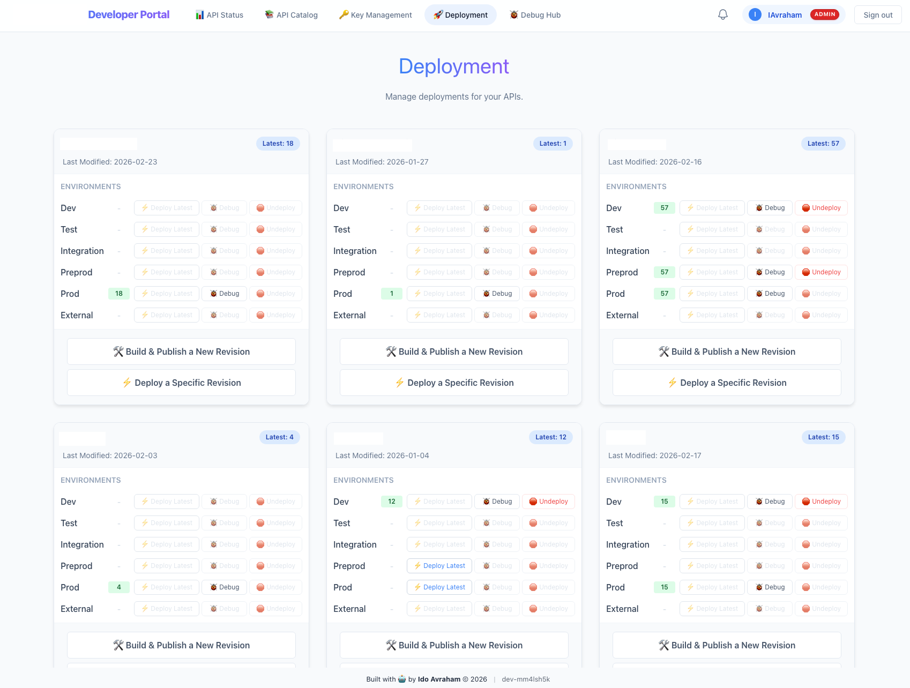
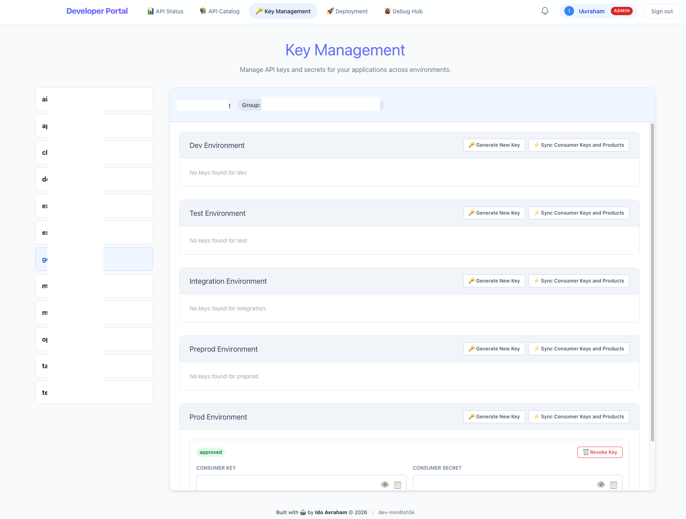
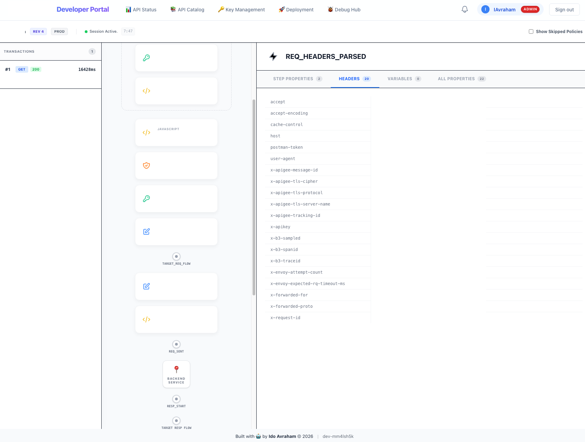
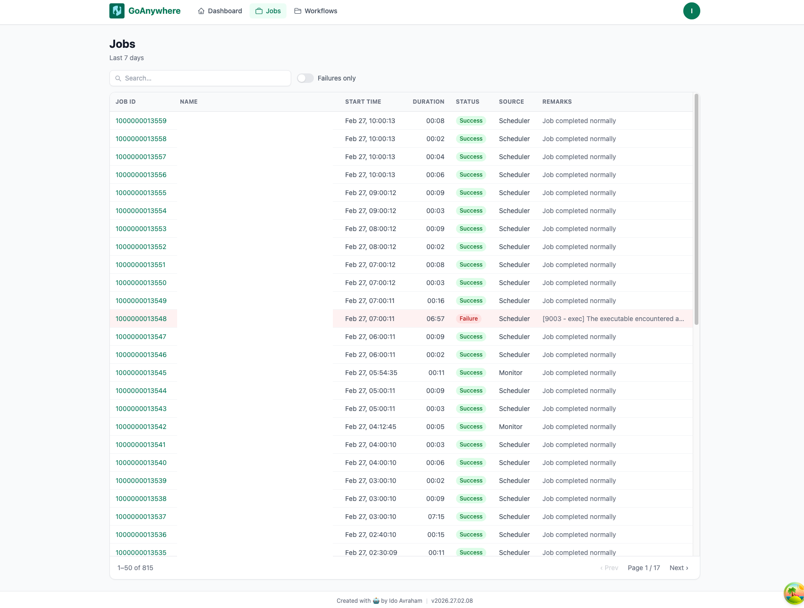
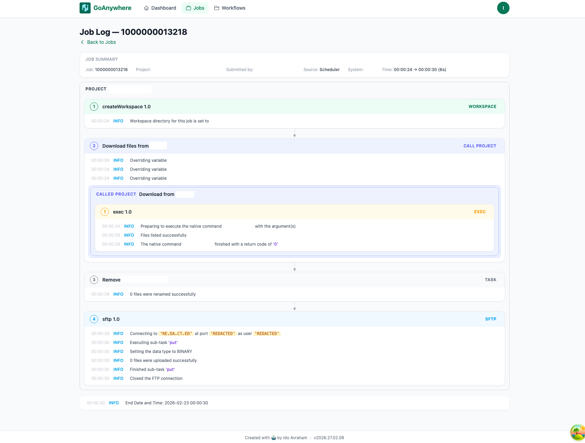
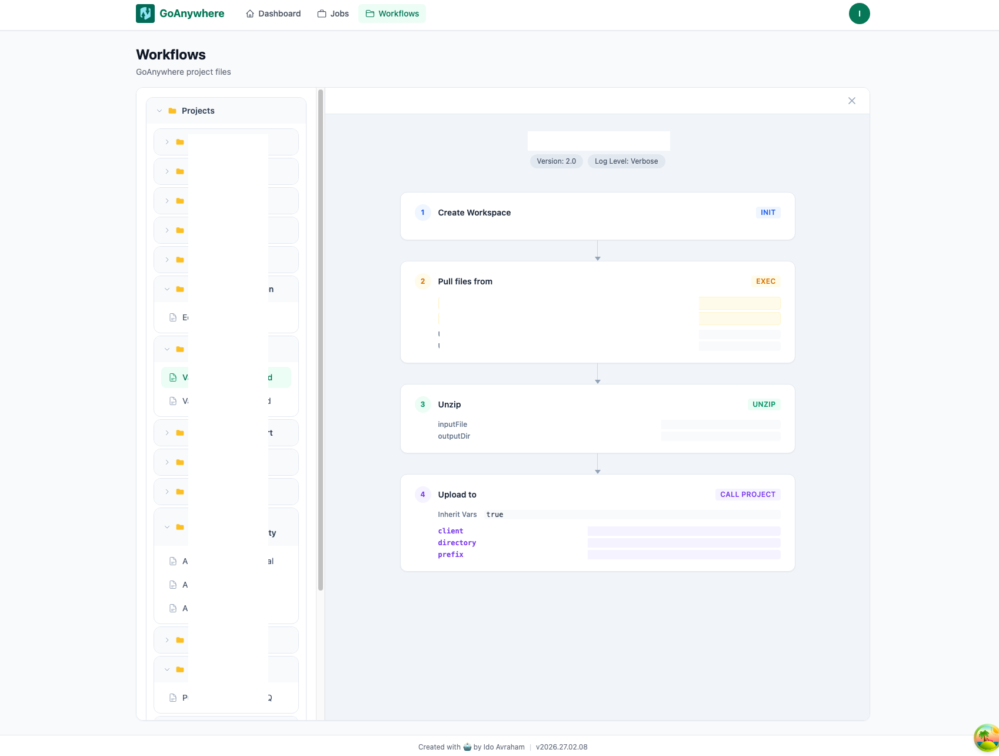
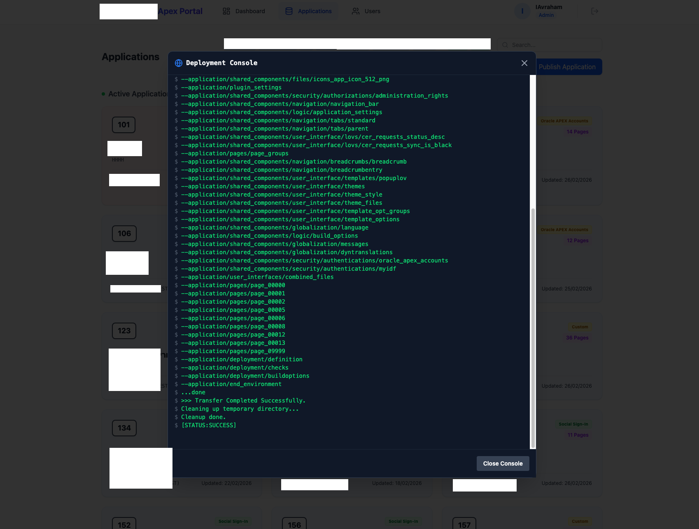

+++
date = '2026-02-26T20:39:23+02:00'
draft = false
title = 'Vibe-Coding the Last Mile'
+++

> _Sometimes you don't need to conquer the world or reinvent the wheel — you just need to add the final touch on an already working tool with a blind spot._

---

## The Premise

There's a certain kind of problem that doesn't get talked about enough in platform engineering: **the almost great tool**.

You've procured it. It's enterprise-grade. It solves the core problem. It has a support contract and a roadmap and a Gartner Magic Quadrant placement. But there's this one corner — a control plane that looks like it was designed in 2009, an all-or-nothing permission model, a developer portal nobody uses voluntarily, a CI/CD story that requires a manual checklist and a prayer — that **quietly drains productivity every single day**.

The traditional answer is to wait for the vendor to fix it, raise a support ticket, upvote a feature request, or accept the pain as the cost of doing business.

My answer was to **vibe code around it**.

---

## Three Blind Spots, Three SPAs

Over the past year, I identified three enterprise platforms in active use across my organization, each excellent in its domain, each with a stubborn blind spot that was costing developers time, confidence, and sanity. I built a focused single-page application for each one — not to replace the platform, but to wrap it in exactly the control plane it was missing.

The constraints were intentional: RBAC aligned to my organization's established patterns, GitOps-based configuration, and surfaces that let developers trigger workflows, manage resources, and promote changes — all within a tightly scoped set of allowed, predetermined operations. No raw access to the underlying system. No footguns. **Just the right operations, presented clearly, secured properly.**

---

### 1. Google Apigee — Rescuing the Developer Portal

**The platform:** Apigee is a best-in-class API management platform. Proxy configuration, traffic management, security policies, analytics — it handles the hard parts of running APIs at scale with genuine sophistication.

**The blind spot:** The developer portal. Apigee's bundled portal is Drupal-based, and calling it "showing its age" is generous. For API consumers trying to discover, understand, and onboard to internal APIs, it was a barrier rather than a bridge. The experience of promoting APIs between environments — dev, staging, production — was manual enough to be error-prone and opaque enough to create confusion about what was deployed where.

**The SPA:** A developer-facing portal built for the actual workflow: browse APIs, explore specs, manage application credentials, and understand the current deployment state across environments. Developers can trigger promotion workflows — config lives in GitHub, the site surfaces the operations and status — without ever needing access to the Apigee console itself.

API key management is self-service within guardrails. Workflow triggers are audit-logged. **The portal knows what you're allowed to do and shows you only that.**

---

  <figure style="flex: 1; min-width: 0; margin: 0; text-align: center;">
    
    <figcaption style="font-size: 0.85em; color: gray; margin-top: 8px;">Environment promotion</figcaption>
  </figure>
  <figure style="flex: 1; min-width: 0; margin: 0; text-align: center;">
    
    <figcaption style="font-size: 0.85em; color: gray; margin-top: 8px;">Key management</figcaption>
  </figure>
  <figure style="flex: 1; min-width: 0; margin: 0; text-align: center;">
    
    <figcaption style="font-size: 0.85em; color: gray; margin-top: 8px;">API debug hub</figcaption>
  </figure>

---

### 2. GoAnywhere MFT — Taming the File Transfer Beast

**The platform:** GoAnywhere MFT is a serious, capable managed file transfer solution. It handles complex transfer workflows, scheduling, encryption, and partner connectivity with reliability that justifies its enterprise price tag.

**The blind spot:** The control plane. A dense, dated UI that buries the information operators actually need. Logs are verbose, poorly structured, and hard to reason about — understanding why a workflow behaved a certain way meant wading through walls of raw output. Gaining any meaningful visibility into the _nature_ of a workflow — its steps, its dependencies, its failure modes — required either deep familiarity with the system or a significant time investment. On top of that, RBAC management was cumbersome enough that granting a developer the right level of access — no more, no less — was an exercise in frustration.

**The SPA:** A clean operations dashboard built around what developers and operators actually need to see: job status, structured transfer history, and human-readable workflow summaries — surfaced in a way that makes the current state of the system immediately obvious. Instead of log archaeology, operators get a clear picture of what ran, what failed, and _why_, without needing to be GoAnywhere power users.

RBAC is modeled on the role patterns already understood in the organization. A developer sees their workflows. An operator sees the broader picture. **Nobody accidentally touches what they shouldn't.**

---

  <figure style="flex: 1; min-width: 0; margin: 0; text-align: center;">
    
    <figcaption style="font-size: 0.85em; color: gray; margin-top: 8px;">Job status</figcaption>
  </figure>
  <figure style="flex: 1; min-width: 0; margin: 0; text-align: center;">
    
    <figcaption style="font-size: 0.85em; color: gray; margin-top: 8px;">Job log</figcaption>
  </figure>
  <figure style="flex: 1; min-width: 0; margin: 0; text-align: center;">
    
    <figcaption style="font-size: 0.85em; color: gray; margin-top: 8px;">Workflow</figcaption>
  </figure>

---

### 3. Oracle APEX — Closing the Promotion Gap

**The platform:** Oracle APEX is a genuinely impressive low-code development environment. The speed at which you can build data-driven applications directly on an Oracle database is remarkable, and the platform has matured significantly.

**The blind spot:** The promotion process. APEX's story for managing and controlling version upgrades between environments — development, test, production — has historically been underpowered relative to what teams building on modern stacks expect. Promoting an application involved a sequence of steps: exporting packages, running installation scripts, managing schema changes, and verifying the outcome — each step requiring just enough access and just enough knowledge to be risky in the wrong hands. The scripting involved was largely invisible to the developer triggering the promotion, and there was no clear audit trail of what had actually been executed, in what order, and with what result.

**The SPA:** A promotion interface that brings structure, visibility, and guardrails to the APEX deployment lifecycle. Developers can initiate a promotion through a guided workflow that surfaces exactly which scripts will run, in what sequence, and what each step does — _before_ they commit. The system then executes within a tightly controlled scope: no direct database access, no ability to deviate from the approved script set, and a full execution log after the fact.

The result is a process where developers have meaningful visibility into what's happening under the hood, but the blast radius of any action is bounded by design. **Promoting to production feels like a deliberate, informed decision rather than a leap of faith.**

---

  <figure style="width: 32%; margin: 0; text-align: center;">
    
    <figcaption style="font-size: 0.85em; color: gray; margin-top: 8px;">Deployment Console</figcaption>
  </figure>

---

## The Architecture Philosophy

All three applications share a common set of design principles that emerged from the same organizational context:

**GitOps as the source of truth.** Configuration, RBAC definitions, and workflow parameters live in GitHub. The SPAs are surfaces for reading that config and triggering workflows against it — not stores of state themselves. This means auditability, version history, and change review come for free.

**RBAC on familiar patterns.** Rather than inventing new access models, each application maps onto the role and group structures already in use across the organization. Developers don't need to learn a new permission model; the right access is derived from what they already have.

**Predetermined operations only.** Each SPA exposes a curated set of allowed operations — no more. Developers can trigger what they're supposed to trigger, see what they're supposed to see, and manage what they're supposed to manage. The blast radius of any action is bounded by design.

**Monitoring as a first-class concern.** Every platform had visibility gaps that frustrated the developers using it daily. Each SPA ships with dashboards tuned to the specific operational questions those developers need answered: what's the current state, what recently changed, what needs attention.

---

## Summary and Conclusions

### What I Built

- **Three production SPAs**, each targeting a specific enterprise platform's control plane blind spot
- **Apigee developer portal** — API discovery, credential management, and environment promotion workflows for API consumers and publishers
- **GoAnywhere MFT portal** — operational dashboards, structured log visibility, and simplified RBAC management for managed file transfers
- **Oracle APEX promotion portal** — guided deployment pipeline with pre-promotion script review, guardrails, and full audit trail for APEX application teams

### Key Principles Applied

- **Additive, not replacement** — each tool remains the platform of record; the SPA adds the missing layer
- **GitOps configuration** — all config lives in GitHub; the UI is a trigger and display surface
- **Org-native RBAC** — access models map to existing organizational role patterns
- **Scoped operations** — developers can do exactly what they should be able to do, nothing more
- **Tailored monitoring** — dashboards built around the real operational questions of each platform's users

### Conclusions

- The **"almost great" tool** is one of the most common problems in enterprise platform engineering, and it's chronically underserved
- **Vibe coding** — moving fast, staying focused, and shipping something real — is a legitimate strategy for closing these gaps
- The constraint of **targeting a blind spot rather than rebuilding a platform** is a feature, not a limitation: it keeps scope tight, value immediate, and maintenance burden low
- **Scoped operations with full visibility** is the right balance: developers understand what's happening without being able to cause unintended harm
- Three relatively small applications **materially changed the daily experience** of developers across three different platform domains — sometimes that's exactly the right ambition

---

_The wheel was already invented. It just needed a better dashboard._
